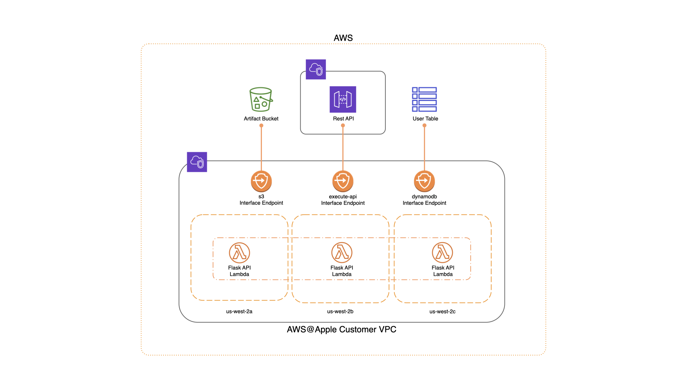

# Amazon API Gateway

## Overview
[API Gateway](https://aws.amazon.com/api-gateway/) is a fully managed service that runs its infrastructure in its own VPCs. While the service offers multiple [endpoint configuration types](https://docs.aws.amazon.com/apigateway/latest/developerguide/api-gateway-api-endpoint-types.html), the only type approved for use in an AWS@Apple account is the private API endpoint. Deploying a REST API with a private endpoint configuration ensures that its endpoints can only be accessed from the VPC running in your AWS@Apple account.

_**Note**: Customers who deploy a public-facing API both increase their risk and will incur additional work in the future when they have to migrate to a private configuration._

In this example, we will be deploying an API Gateway REST API configured with a Private endpoint, a Lambda function containing a Flask API application, and a DynamoDB table that the API interacts with.

The architecture looks like this:



We will configure the REST API to proxy all methods and routes securely to our Flask API. This can be accomplished by configuring a proxy resource that leverages a greedy path variable of `{proxy+}` with an associated `ANY` method, as described [here](https://docs.aws.amazon.com/apigateway/latest/developerguide/api-gateway-set-up-simple-proxy.html).

_**Note**: We're exemplifying a private proxy integration for the sake of simplicity. You can also opt to specify more granular resource & method configurations in order to front multiple backend services with a single API Gateway REST API._

The Lambda function we're deploying contains a simple API written using the Flask framework, enabling us to contain all of our API logic in our internal codebase while taking advantage of the benefits provided by API Gateway, such as:

- Token-based authentication
- Resource-based permissions
- IAM integration for fine-grained access control with IAM roles
- Custom authorizers
- Request and response mapping

The key to get Flask to run inside of Lambda is [`aws-wsgi`](https://pypi.org/project/aws-wsgi/). There are other options available, but this provides a very clean lambda function. For example, this is a valid lambda flask app:

```python
import awsgi
from flask import (
    Flask,
    jsonify,
)

app = Flask(__name__)


@app.route('/')
def index():
    return jsonify(status=200, message='OK')


def lambda_handler(event, context):
    return awsgi.response(app, event, context, base64_content_types={"image/png"})
```

## Prerequisites

#### Environment

The Example Flask application relies on the following environment variable which is passed in through CloudFormation inputs:
```bash
export DYNAMODB_TABLE_NAME=user
```

For local development & testing, we leverage a `.env` file containing these values. In order for the included tests to pass, a `pytest.ini` file needs to be added to `./app/` containing the following:
```ini
[pytest]
env_override_existing_values = 1
env_files =
    /<path>/<to>/.env

```

#### SNS Email Subscription for DynamoDB Alarms
The `./scripts/vars.sh` script exports an `SNS_EMAIL` variable which is passed as an overridden parameter to the DynamoDB CloudFormation Stack. This variable must be set or the build script will exit with an error.


## Deploying API Gateway REST API

```bash
❯ aws-profile dev
[dev] ❯ ./scripts/provision.sh
```

## Connecting to API Gateway REST API from Apple Networks

The 'execute-api' service interface VPC endpoint that is created in accounts by default is configured with "Private DNS enabled", which disables the ability to use all Regional or Edge Optimized API endpoints in the VPC in your account. This means only the private DNS name that is created for the REST API can be used to access it.

Due to this, API Gateway should ideally be used in one of the following scenarios:

1. Entirely contained within the VPC in your AWS@Apple account
2. By using the default [Cloud Native - Private networking model](https://aws.apple.com/about/networking/network-architecture/#supported-networking-models) and leveraging the existing PrivateLink model to expose the REST API back to the AODCs. This approach would require fronting API Gateway with an NLB and deploying an additional Lambda function to keep the NLB targets in sync (similar to the [lambda_alb_dynamodb](https://github.pie.apple.com/CloudTech/aws-apple/tree/master/examples/lambda_alb_dynamodb/) example).
3. Exposed back to the AODCs by [leveraging Denali](https://aws.apple.com/guides/networking/onboarding-to-denali-at-aws-apple/) with a `/28` Enterprise CIDR configured (to limit unnecessary 17-net IP allocation)

## Testing and Validation

_**Note**: For local testing, you will either need to have deployed the stack to create a table or download and configure [DynamoDB Local](https://docs.aws.amazon.com/amazondynamodb/latest/developerguide/DynamoDBLocal.html) with a user table. If you are using DynamoDB Local, you will also need to export a `DYNAMODB_HOST` environment variable that points to the locally running instance._

#### Usage

```bash
[dev] ❯ app/example
[dev] ❯ nohup flask run >/dev/null 2>&1 &
[dev] ❯ ..
[dev] ❯ ./scripts/test_api.sh -h
      Usage: ./scripts/test_api.sh [options]
       -h, --help                 show this message
       -l, --local                only test the Flask API app (must be running on :5000)
       -d, --dsid                 the DSID (prsId) of the user
       --get-user -d <dsid>       GET a user from the api
       --get-users                GET all users from the api
       --create-user -d <dsid>    POST a user to the api
       --delete-user -d <dsid>    DELETE a user from the api

```

#### Examples

```bash
❯ ./scripts/test_api.sh -l --create-user -d 123456789
+ curl -sS -H 'Content-Type: application/json' --data '{"firstName": "Jane", "lastName": "Doe", "emailAddress": "jane_doe@apple.com"}' localhost:5000/api/user/123456789
+ jq
{
  "created": {
    "details": {
      "emailAddress": "jane_doe@apple.com",
      "firstName": "Jane",
      "lastName": "Doe"
    },
    "dsid": "123456789"
  }
}

❯ ./scripts/test_api.sh --create-user -d 123456789
+ aws apigateway test-invoke-method --rest-api-id b7cghlonyh --resource-id cgumej --http-method post --path-with-query-string /api/user/123456789 --body '{"firstName": "Jane", "lastName": "Doe", "emailAddress": "jane_doe@apple.com"}' --headers Content-Type=application/json
+ jq -r .body
+ jq
{
  "created": {
    "details": {
      "emailAddress": "jane_doe@apple.com",
      "firstName": "Jane",
      "lastName": "Doe"
    },
    "dsid": "123456789"
  }
}
```

## To Destroy
Note: since the Lambda exists in a VPC, it takes a long time for CloudFormation to delete the Lambda functions and associated ENIs. We have escalated this as a problem to our account team, but expect the destroy to take around ~45 minutes.

```bash
[dev]$ ./scripts/destroy.sh
```

# Other References
* https://docs.aws.amazon.com/lambda/latest/dg/python-package.html
* https://flask.palletsprojects.com/en/1.1.x/quickstart/
* https://docs.aws.amazon.com/apigateway/latest/developerguide/apigateway-private-apis.html
