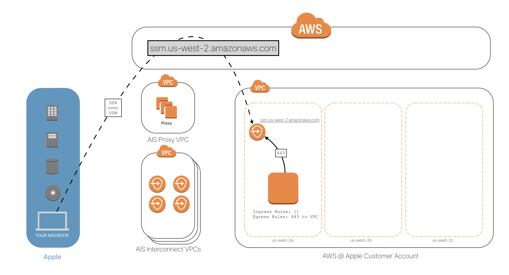

# Using SSH over SSM

In this repository we have some helper scripts to tunnel traditional SSH, rsync and SCP over AWS SSM Systems Manager. It works by injecting a single use SSH key into an instance for 60 seconds, and then establishing a proxied SSH command over an SSM Session.



__NOTE__: If you just need to login into an instance you can do so using SSM only

```bash
aws ssm start-session --target <instance-id>
```

## Prerequisites

### Local SSH Config

Add the following to your local `~/.ssh/config`:

```bash
# SSH over Session Manager
host i-* mi-*
    ProxyCommand sh -c "aws ssm start-session --target %h --document-name AWS-StartSSHSession --parameters 'portNumber=%p'"
```

Note that this configuration stanza matches host names that start with "i-" or "mi-" (EC2 Instance IDs), and proxies the connections over an SSM Session. This means that you will need IAM credentials to launch an SSM session in order to use SSH. Additionally, you will need to dynamically inject an SSH key into the instance via `ec2-instance-connect` to complete the host-key verification.

### Instance Requirements

The instance needs to be running the latest version of the SSM Agent (`2.3.672.0`, or later), and also have `ec2-instance-connect` installed. By using the latest version of the AIS AMIs, both of these will be done on your behalf.

If you would like to test, we recommend using the example in [../SingleEC2Instance](../SingleEC2Instance#connecting-to-your-instance-via-ssm).

### AWS CLI requirements

In order to use `ec2-instance-connect` you'll need a version of AWS CLI >= 1.16.189

```bash
pip3 install awscli --upgrade
```

You'll also need to have the AWS [SSM CLI plugin](https://docs.aws.amazon.com/systems-manager/latest/userguide/session-manager-working-with-install-plugin.html) installed. That comes included when you run through the [../../setup](AWS@Apple CLI Setup).

## `ssh` usage

```bash
$ aws-profile dev
[dev]$ ./aws-ssh.sh ec2-user i-0c0901bee80f198f1
Last login: Mon Jul 15 17:56:17 2019 from localhost

       __|  __|_  )
       _|  (     /   Amazon Linux 2 AMI
      ___|\___|___|

https://aws.amazon.com/amazon-linux-2/
[ec2-user@ip-100-64-55-48 ~]$ w
 17:57:10 up 5 days,  2:06,  1 user,  load average: 0.48, 0.34, 0.24
USER     TTY      FROM             LOGIN@   IDLE   JCPU   PCPU WHAT
ec2-user pts/0    localhost        17:57    1.00s  0.01s  0.00s w
[ec2-user@ip-100-64-55-48 ~]$ uname -a
Linux ip-100-64-55-48.us-west-2.compute.internal 4.14.128-112.105.amzn2.x86_64 #1 SMP Wed Jun 19 16:53:40 UTC 2019 x86_64 x86_64 x86_64 GNU/Linux
[ec2-user@ip-100-64-55-48 ~]$ pstree
systemd─┬─acpid
        ├─2*[agetty]
        ├─amazon-ssm-agen─┬─ssm-session-wor───6*[{ssm-session-wor}]
        │                 └─13*[{amazon-ssm-agen}]
        ├─artemisd───12*[{artemisd}]
        ├─atd
        ├─auditd───{auditd}
        ├─aws───50*[{aws}]
        ├─chronyd
        ├─crond
        ├─dbus-daemon
        ├─2*[dhclient]
        ├─dnsmasq
        ├─fluentd─┬─ruby───15*[{ruby}]
        │         └─3*[{fluentd}]
        ├─gssproxy───5*[{gssproxy}]
        ├─irqbalance───{irqbalance}
        ├─lsmd
        ├─lvmetad
        ├─master─┬─pickup
        │        └─qmgr
        ├─qualys-cloud-ag
        ├─rngd
        ├─rpcbind
        ├─rsyslogd───2*[{rsyslogd}]
        ├─sshd───sshd───sshd───bash───pstree
        ├─systemd-journal
        ├─systemd-logind
        └─systemd-udevd
[ec2-user@ip-100-64-55-48 ~]$ exit
logout
Connection to i-0c0901bee80f198f1 closed.
```

## `scp` usage

```bash
$ aws-profile dev
[dev]$ mkdir test_folder
[dev]$ touch test_folder/test_file
[dev]$ ./aws-scp.sh ec2-user i-0c0901bee80f198f1 -r test_folder/ ec2-user@i-0c0901bee80f198f1:~/
test_file                                                                                                                                                                                                   100%    0     0.0KB/s   00:00
[dev]$ ./aws-ssh.sh ec2-user i-0c0901bee80f198f1 'ls -laR ~/test_folder'
/home/ec2-user/test_folder:
total 0
drwxr-xr-x 2 ec2-user ec2-user  23 Jul 16 23:13 .
drwx------ 4 ec2-user ec2-user 114 Jul 16 23:13 ..
-rw-r--r-- 1 ec2-user ec2-user   0 Jul 16 23:13 test_file
```

## `rsync` usage

```bash
$ aws-profile dev
[dev]$ mkdir test_folder
[dev]$ touch test_folder/test_file
[dev]$ touch test_folder/test_file_2
[dev]$ ./aws-rsync.sh ec2-user i-0c0901bee80f198f1 -avz test_folder ec2-user@i-0c0901bee80f198f1:~/
building file list ... done
test_folder/
test_folder/test_file
test_folder/test_file_2

sent 213 bytes  received 70 bytes  43.54 bytes/sec
total size is 0  speedup is 0.00
[dev]$ ./aws-ssh.sh ec2-user i-0c0901bee80f198f1 'ls -laR ~/test_folder'
/home/ec2-user/test_folder:
total 0
drwxr-xr-x 2 ec2-user ec2-user  42 Jul 16 23:21 .
drwxr-xr-x 4 ec2-user ec2-user 114 Jul 16 23:21 ..
-rw-r--r-- 1 ec2-user ec2-user   0 Jul 16 23:11 test_file
-rw-r--r-- 1 ec2-user ec2-user   0 Jul 16 23:18 test_file_2
[dev]$ touch test_folder/test_file_3
[dev]$ ./aws-rsync.sh ec2-user i-0c0901bee80f198f1 -avz test_folder ec2-user@i-0c0901bee80f198f1:~/
building file list ... done
test_folder/
test_folder/test_file_3

sent 183 bytes  received 48 bytes  35.54 bytes/sec
total size is 0  speedup is 0.00
```

## TODO

* Replace the random `ssh-keygen` with our `memento`-based SSH keys.

## Related Documentation

* https://docs.aws.amazon.com/AWSEC2/latest/UserGuide/ec2-instance-connect-methods.html#ec2-instance-connect-connecting-aws-cli
* https://docs.aws.amazon.com/systems-manager/latest/userguide/session-manager-getting-started-enable-ssh-connections.html
