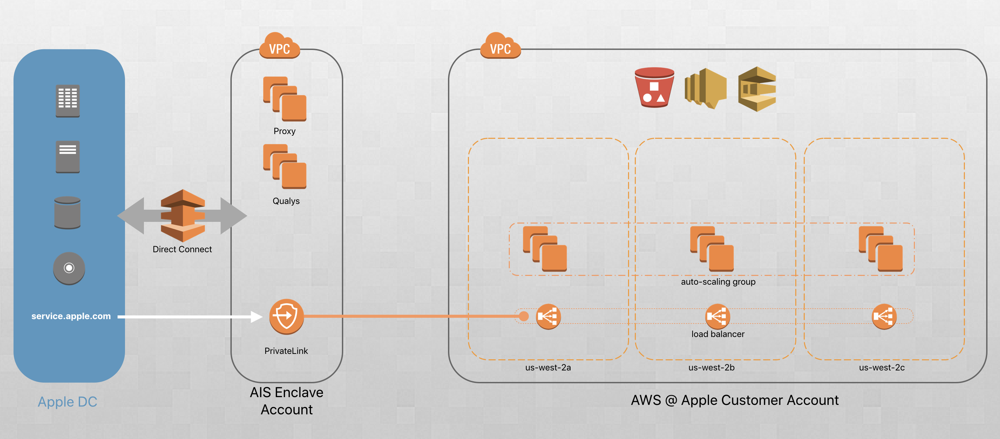

# An AIS Example Web Stack

In this folder we have a self contained multi-teir app with a Network Load Balancer, Auto-Scaling App Server, and VPC Endpoint Service deployed via a multi-stage CodePipeline. When put together, the architecture should look like:



The goal of this example is to make a realistic, yet simple deployment process.

# Prerequisites

Before running this stack, you should setup your [CLI environment](../../setup/). Besides that, there will be nothing else expected in your local environment.

# Deploying the Stack

To deploy the stack, simply run: `./provision.sh`.

# Updating the Stack

If you need to update any of the resources in the the CodePipeline or CloudFormation templates, simply make the change, and then run: `./provision.sh`. That will trigger the redeployment. If you edit the user-data of the auto-scaling instance, that will also trigger a rolling re-deploy of the instances (2/3 at a time), which re-launches the instances and re-runs the full Ansible playbook

# Updating the Running Instances

If you changed the Ansible playbook, and want to run that on the instances without changing the auto scaling group, you can just trigger a playbook run by doing the following: `./update_hosts.sh`.

# Deleting the Stack

To delete the stack, simply run: `./destroy.sh`.

# Accessing the PrivateLink connection

After the CodePipeline is fully deployed your endpoint service and interface endpoint will both be created. You can get the DNS name of the Interface Endpoint (the component which is create in the AIS account) like this:

```bash
$ aws cloudformation list-exports | jq '.Exports[] | select(.Name | contains("VPCE-DNSName"))'
{
  "ExportingStackId": "arn:aws:cloudformation:us-west-2:117117185606:stack/multitier-pl-vpce-1171-jane-/90aedfd0-49c7-11e9-87bd-02ee71065ed8",
  "Name": "multitier-pl-vpce-1171-jane--VPCE-DNSName",
  "Value": "vpce-024495f1bfc663133-jm0cxy4m.vpce-svc-060389c5d7af6da47.us-west-2.vpce.amazonaws.com"
}
```

Now your service can be hit from the Apple Desktop network.

```bash[dev]$ curl -I vpce-024495f1bfc663133-jm0cxy4m.vpce-svc-060389c5d7af6da47.us-west-2.vpce.amazonaws.com:8080
HTTP/1.1 200 OK
Server: gunicorn/19.9.0
Date: Mon, 18 Mar 2019 21:57:38 GMT
Connection: close
Content-Type: text/html; charset=utf-8
Content-Length: 310

[dev]$ curl vpce-024495f1bfc663133-jm0cxy4m.vpce-svc-060389c5d7af6da47.us-west-2.vpce.amazonaws.com:8080
<!doctype html>
<html>
<head>
<title>AIS Sample App</title>
</head>
<body>

  <h1>Hello from AWS!</h1>
  <p>This response is coming from:</p>
  <ul>
    <li>Instance ID: i-081fc6ac521e1b5d2</li>
    <li>IP Address: 100.64.190.6</li>
    <li>Running in availabilty zone: us-west-2c</li>
  </ul>

</body>
```

# See Also
* [CodePipeline Cloudformation Reference](https://docs.aws.amazon.com/AWSCloudFormation/latest/UserGuide/aws-resource-codepipeline-pipeline.html)
* [CodePipeline Pipeline Structure Reference](https://docs.aws.amazon.com/codepipeline/latest/userguide/reference-pipeline-structure.html#action-requirements)

# Additional Resources
* [Getting Started Guide](https://docs.aws.amazon.com/autoscaling/ec2/userguide/AutoScalingGroup.html)
* [Automating Instance Updates](https://aws.apple.com/guides-and-resources/guides/ec2/automating-instance-updates/)
