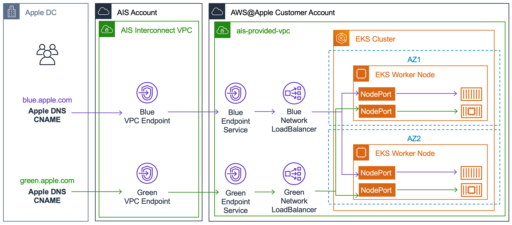
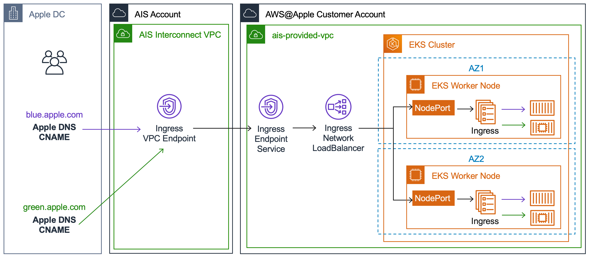

# Table of Contents

<!-- TOC depthFrom:1 depthTo:6 withLinks:1 updateOnSave:1 orderedList:0 -->
- [Introduction to EKS](#introduction-to-eks)
  - [Security benefits of EKS at AWS@Apple](#security-benefits-of-eks-at-awsapple)
  - [Security Guidelines](#security-guidelines)
  - [Limitations](#limitations)
- [Create a sample EKS cluster](#create-a-sample-eks-cluster)
  - [Obtaining kubectl config](#obtaining-kubectl-config)
  - [Custom RBAC for EKS cluster](#custom-rbac-for-eks-cluster)
- [How to upgrade](#how-to-upgrade)
- [Exporting a kubernetes service to Apple Network](#exporting-a-kubernetes-service-to-apple-network)
  - [Option A: Create a service of type LoadBalancer](#option-a-create-a-service-of-type-loadbalancer)
  - [Option B: Deploy an ingress-nginx controller](#option-b-deploy-an-ingress-nginx-controller)
  - [Expose a NLB to Apple Network](#expose-a-nlb-to-apple-network)
- [Internet Egress from pods](#internet-egress-from-pods)
- [Destroy & Cleanup](#destroy-&-cleanup)
- [Useful tools](#useful-tools)
<!-- /TOC -->

## Introduction to EKS

[Amazon EKS](https://docs.aws.amazon.com/eks/latest/userguide/what-is-eks.html) or Elastic Kubernetes Service is a managed service that provides a higly available Kubernetes control plane.

[Kubernetes](https://kubernetes.io/docs/concepts/overview/what-is-kubernetes/) is a platform for managing containerized workloads. It provides a declarative API that facilitates Infrastructure as Code and can be deployed on multi-cloud environments. This means that a kubernetes cluster can run on Baremetal, AWS, GCP or any other cloud provider and the applications can be deployed with minimal to no modifications at all.

EKS makes it easy to manage a Kubernetes cluster by automating several time consuming and error prone tasks such as cluster deployment, version upgrades, patching and replacement of unhealthy instances.

An alternative for EKS is [Amazon ECS](https://docs.aws.amazon.com/AmazonECS/latest/developerguide/Welcome.html) which is amazon's own container orchestration engine. ECS has better integration with Amazon Web Services but is not available on premises or on different cloud providers. Applications written for ECS could need from little to high amount of rework in case of migration to a different cloud.

### Security benefits of EKS at AWS@Apple

By using this scripts you get the following features out of the box:

- Encryption at Rest:
  - The default [StorageClass](https://docs.aws.amazon.com/eks/latest/userguide/storage-classes.html) (gp2) is encrypted at rest with KMS
  - Kubernetes secrets are encrypted at rest using [AWS Encryption Provider](https://aws.amazon.com/blogs/containers/using-eks-encryption-provider-support-for-defense-in-depth/)
- Secured [EKS cluster endpoint](https://docs.aws.amazon.com/eks/latest/userguide/cluster-endpoint.html): AWS@Apple automatically changes the access control of the public EKS Cluster endpoint to allow incomming connections only from Apple CIDRs
- IAM Authentication: You can map IAM roles with RBAC. See [Custom RBAC for EKS cluster](#custom-rbac-for-eks-cluster)
- [Cluster Autoscaler](https://docs.aws.amazon.com/eks/latest/userguide/cluster-autoscaler.html)

### Security Guidelines

Here are some security guidelines and best practices to follow:

- Follow [configuration best practices](https://kubernetes.io/docs/concepts/configuration/overview/)
- Make use of [Pod Security Policies](https://aws.amazon.com/blogs/opensource/using-pod-security-policies-amazon-eks-clusters/)
- Configure [RBAC](#custom-rbac-for-eks-cluster)
- Use a minimal operating system for containers (for example, [alpine](https://hub.docker.com/_/alpine) or [distroless](https://github.com/GoogleContainerTools/distroless))
- Follow Infosec's [security guideline](https://infosec.apple.com/guidance/engineering/resources/baselines_and_sigs/kubernetes_guideline/) for kubernetes

### Limitations

- Multi-tenant services: While containers provide a strong degree of isolation, they do not offer as clear and concrete of a security boundary as a VM. Because containers share the same kernel and can be run with varying capabilities and privileges on a host, the degree of segmentation between them is far less than that provided to VMs by a hypervisor.
An alternative is to use use [node affinity/antiaffinity](https://kubernetes.io/docs/concepts/configuration/assign-pod-node/) rules to control which workloads are assigned to which worker nodes.

## Create a sample EKS cluster

1. Modify `vars.sh` to override varibles from `vars.defaults`

  ```bash
  # Override variables from vars.defaults here
  export CLUSTER_NAME=dev-cluster
  export WORKER_INSTANCE_TYPE=t3.small
  export NUM_NODES=5
  export MIN_NUM_NODES=2
  export MAX_NUM_NODES=10
  ```

1. Run `provision.sh` script to bootstrap cluster.

   ```bash
   ./provision.sh
   ```

   The script will deploy EKS cluster into your account and configure `kubectl` to access it.

1. Test your EKS clusters

  ```bash
  kubectl get nodes
  kubectl get po --all-namespaces
  ```

** You should see the instances and pod listed from those commands.

### Obtaining kubectl config

Once cluster is up and running, you can obtain `kubectl` config for any cluster in your account as

```bash
aws eks update-kubeconfig --name <CLUSTER_NAME>
```

### Custom RBAC for EKS cluster

Process for managing users and roles for newly deployed cluster is documented [here](https://docs.aws.amazon.com/eks/latest/userguide/add-user-role.html).

For example, if you need to grant `developer_role` in your AWS@Apple account access to `default` namespace in EKS cluster, create a `RoleBinding`

```yaml
cat << EOF | kubectl apply -f -
---
kind: RoleBinding
apiVersion: rbac.authorization.k8s.io/v1
metadata:
   name: default-admins
   namespace: default   # Replace it with namespace you would like to give access to
subjects:
- kind: Group
  name: default-admins  # Name of the group mapped in aws-auth
  apiGroup: rbac.authorization.k8s.io
roleRef:
  kind: ClusterRole
  name: edit  # ClusterRole to grant permissions to (you can create a custom role for more granular permissions)
  apiGroup: rbac.authorization.k8s.io
EOF
```

edit `aws-auth` configmap `mapRoles` section as follows

```yaml
- rolearn: "arn:aws:iam::<AWS_ACCOUNT_ID>:role/developer_role"
  username: developer
  groups:
    - default-admins
```

It will grant `developer_role` (AWS IAM Role), `edit` (EKS Cluster Role) privileges to `default` namespace. It allows read/write access to most objects in a namespace. It does not allow viewing or modifying roles or role bindings. See [Kubernetes RBAC documentation](https://kubernetes.io/docs/reference/access-authn-authz/rbac/#default-roles-and-role-bindings) for more information.

For binding `custom_role` to a namespace, follow [AWS custom role with AWS EKS](iam_custom_role_namespace.md) guide.

### IAM roles for Kubernetes Service Accounts

Amazon EKS now allows you to assign IAM permissions to Kubernetes service accounts. This gives you fine-grained, pod level access control when running clusters with multiple co-located services. Please follow [AWS documentation](https://docs.aws.amazon.com/eks/latest/userguide/enable-iam-roles-for-service-accounts.html) to enable this feature.


### A note about us-east-1

**TL;DR**: Worker nodes in us-east-1 get their domain set to `ec2.internal` to work-around a problem with EKS.

**The long version**:

For historical reasons, us-east-1 uses a different domain by default than other AWS regions,
`ec2.internal`. Our VPC config in us-east-1 overrides this to make it consistent with the rest of
AWS, using `us-east-1.compute.internal` as the default domain.

This causes a conflict with EKS, which assumes that nodes in us-east-1 use the default
`ec2.internal` domain. The result is that nodes are registered as `<host>.ec2.internal`, but their
actual hostnames are `<host>.us-east-1.compute.internal`. This in turn causes problems for
`kube-proxy`, which assumes that the kube nodename and system hostname are the same.

To resolve this, the node bootstrap scripts (in EKSWorkerNode.yaml and terraform/userdata/eks.sh)
contain a snippet that changes the system hostname of us-east-1 worker nodes to
`<host>.ec2.internal`:

```bash
if [[ ${AWS::Region} == us-east-1 ]]; then
    hostnamectl set-hostname $(hostname | sed 's/\..*/.ec2.internal/')
fi
```

This ensures that kube nodename == system hostname and allows kube-proxy to function correctly.

## How to Upgrade

1. Run `provision.sh` and specify version to upgrade when asked for Kubernetes version.
2. Specify appropriate Worker AMI matching version to be upgraded. Please refer to `EKSWorkerNode.yaml` for list of allowed AMIs.

Re-running `provision.sh` will trigger control plane upgrade first. Once control plane upgrade is complete, worker nodes will perform rolling update to upgrade to next version. Please note that, cluster upgrade using this method is disruptive operation. For graceful upgrades, see [AWS documentation](https://docs.aws.amazon.com/eks/latest/userguide/migrate-stack.html) for migrating to new worker node group.

**Note:** In order for EKS to successfully perform worker node upgrades, `max-num-worker-nodes` must be higher than `desired-num-worker-nodes`.

## Exporting a kubernetes service to Apple Network

There are two ways to expose a kubernetes service to the apple network

The first way is to create a service of `type: LoadBalancer` which will create an NLB which provides the ability to expose the service through a PrivateLink connection. One potential drawback of this approach is the need to create a separate NLB and Interface VPC Endpoint for each service that you want to expose.



The other way is to deploy an [ingress](https://kubernetes.io/docs/concepts/services-networking/ingress/) controller. This will create a NLB for which you can request a VPC Endpoint. The advantage of this approach is that you can reuse the same NLB and VPCE for multiple services and deliver the traffic to the appropiate service using host based or path based routing. An [ingress-nginx](https://kubernetes.github.io/ingress-nginx/) controller can terminate SSL connections when the certificates are provided in the ingress rule.



### Option A: Create a service of type LoadBalancer

1. Create a `service` of type `LoadBalancer`. Add following **annotations** to your service definition

    ```yaml
    service.beta.kubernetes.io/aws-load-balancer-type: nlb
    service.beta.kubernetes.io/aws-load-balancer-internal: 0.0.0.0/0
    ```

    For example:

    ```yaml
    apiVersion: v1
    kind: Service
    metadata:
      annotations:
        service.beta.kubernetes.io/aws-load-balancer-type: nlb
        service.beta.kubernetes.io/aws-load-balancer-internal: 0.0.0.0/0
      labels:
        app: grafana
      name: grafana
      namespace: grafana
    spec:
      ports:
        - name: service
          nodePort: 31947
          port: 80
          protocol: TCP
          targetPort: 3000
      selector:
        app: grafana
      type: LoadBalancer
    ```

    Note: By default service type `LoadBalancer` only work with private subnets. For public subnets reach out to `Cloud Technologies Solutions` team.

### Option B: Deploy an ingress-nginx controller

To deploy `ingress-nginx` on EKS cluster run the following command

```bash
kubectl apply -k apps/ingress-nginx/overlays/dev
```

`kubectl -k` uses [kustomize](https://github.com/kubernetes-sigs/kustomize) which allow us to keep a `base` layer with the upstream templates and override them with a `overlay` layer for each environment where we keep our custom values using just yaml and avoiding any templating language.

The `apps/ingress-nginx/overlays/dev` layer already contains a customization to deploy the ingress-nginx service behind an internal Network LoadBalancer. You can further edit the dev environment to your needs or create a new overlay layer.

### Expose a NLB to Apple Network

1. Edit `AISVpcEndpoint` resource in [EKSVpcEndpoint.yaml](EKSVpcEndpoint.yaml) to allow service ports and CIDR address. (Default is port 443 on 17.0.0.0/8)

2. Run

   ```bash
   make eks-privatelink \
     CLUSTER_NAME=<CLUSTER_NAME> \
     NAMESPACE=<namespace> \
     SVC=<svc name>
   ```

3. PrivateLink DNS Name will be printed on screen or can be found in `PrivateLinkDNSName` output for the stack created in the previous step.

4. Optionally request Apple DNS to create a subdomain `*.apple.com` (e.g https://your-subdomain.apple.com/) to resolves to the PrivateLink endpoint. More info at [Apple-to-AWS-Private-Connection](https://aws.apple.com/guides/networking/apple-to-aws-private-connection)

5. Optionally deploy Apple corp ssl cert on NLB with above requested subdomain. More info at [Crypto-Service-Cert-Script-Repo](https://github.pie.apple.com/crypto-services/cert-scripts-aws/blob/master/docs/get_apple_server_cert_for_aws.md)

   ```bash
   # download script from https://github.pie.apple.com/crypto-services/cert-scripts-aws/blob/master/get_apple_server_cert_for_aws.sh
   bash get_apple_server_cert_for_aws.sh --eks-nlb \
     --fqdn <your-subdomain.apple.com> \
     --mgmt-group-dsid <DSID_of_cert_management_group> \
     --eks-namespace <namespace> \
     --eks-service-name <svc name>
   ```

## Internet Egress from pods

Egress to internet from EKS pods is via [AIS Egress Proxy](https://aws.apple.com/about/networking/internet-ingress-and-egress/). To configure egress proxy inside pod, create ConfigMap as follows -

```yaml
cat << EOF | kubectl apply -f -
---
apiVersion: v1
kind: ConfigMap
metadata:
  name: proxy-environment-variables
data:
  HTTPS_PROXY: http://proxy.config.pcp.local:3128
  HTTP_PROXY: http://proxy.config.pcp.local:3128
  NO_PROXY: localhost,127.0.0.1,169.254.169.254,${VPC_CIDR},10.100.0.0/16,.internal,.apple.com,.execute-api.${AWS_REGION}.amazonaws.com,.s3.${AWS_REGION}.amazonaws.com,.${AWS_REGION}.eks.amazonaws.com,.${AWS_REGION}.vpce.amazonaws.com,amazonlinux.${AWS_REGION}.amazonaws.com,api.sagemaker.${AWS_REGION}.amazonaws.com,cloudformation.${AWS_REGION}.amazonaws.com,cloudtrail.${AWS_REGION}.amazonaws.com,codebuild-fips.${AWS_REGION}.amazonaws.com,codebuild.${AWS_REGION}.amazonaws.com,config.${AWS_REGION}.amazonaws.com,dynamodb.${AWS_REGION}.amazonaws.com,ec2.${AWS_REGION}.amazonaws.com,ec2messages.${AWS_REGION}.amazonaws.com,elasticloadbalancing.${AWS_REGION}.amazonaws.com,events.${AWS_REGION}.amazonaws.com,kinesis.${AWS_REGION}.amazonaws.com,kms.${AWS_REGION}.amazonaws.com,logs.${AWS_REGION}.amazonaws.com,monitoring.${AWS_REGION}.amazonaws.com,runtime.sagemaker.${AWS_REGION}.amazonaws.com,secretsmanager.${AWS_REGION}.amazonaws.com,servicecatalog.${AWS_REGION}.amazonaws.com,sns.${AWS_REGION}.amazonaws.com,ssm.${AWS_REGION}.amazonaws.com,ssmmessages.${AWS_REGION}.amazonaws.com,sts.${AWS_REGION}.amazonaws.com
EOF
```

Add following snippet to application deployment spec to `HTTP_PROXY` environment variables inside pod -

```yaml
spec:
  containers:
    - envFrom:
      - configMapRef:
          name: proxy-environment-variables
```

## Destroy & Cleanup

To destroy and cleanup existing cluster -

```bash
make cleanall CLUSTER_NAME=<CLUSTER_NAME>
```

## Useful tools

- [kubectx](https://github.com/ahmetb/kubectx) - kubectx is a utility to manage and switch between kubectl contexts and namespaces.
- [kustomize](https://kustomize.io) - Kubernetes native configuration management for multiple environments.

## Additional Resources

- [Getting Started Guide](https://docs.aws.amazon.com/eks/latest/userguide/getting-started.html)
- [Automating Instance Updates](https://aws.apple.com/guides-and-resources/guides/ec2/automating-instance-updates/)
