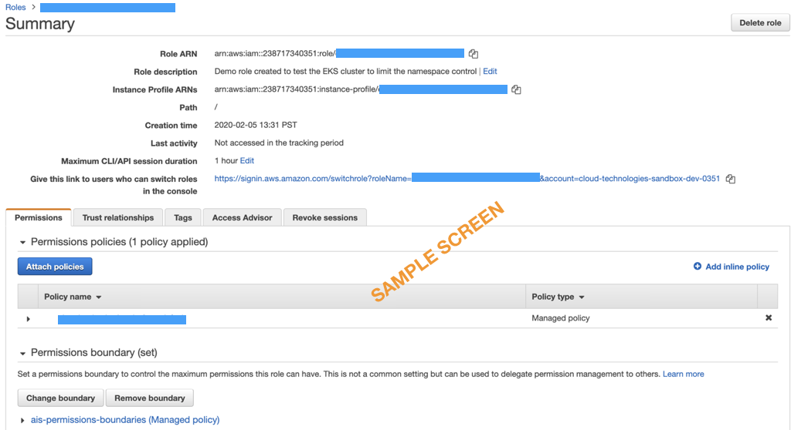
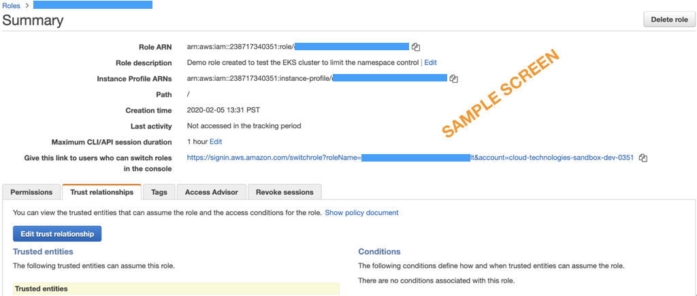
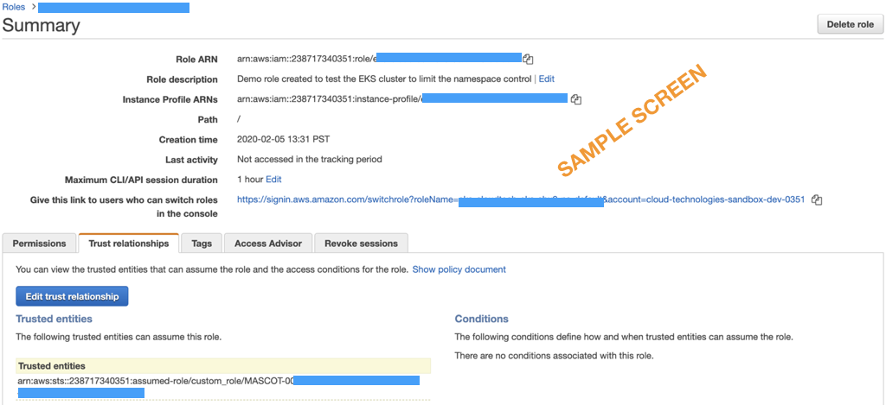
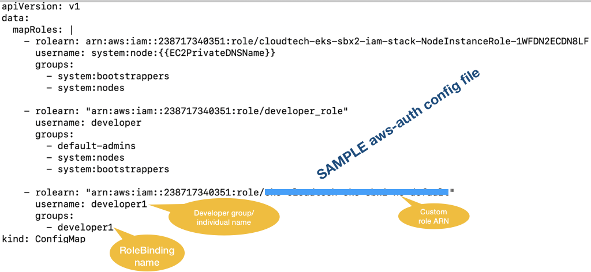
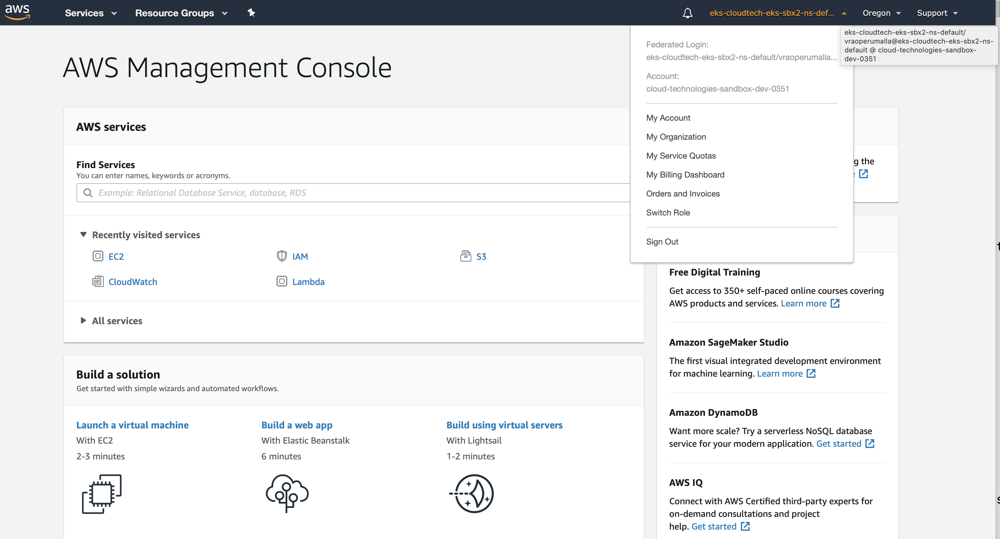
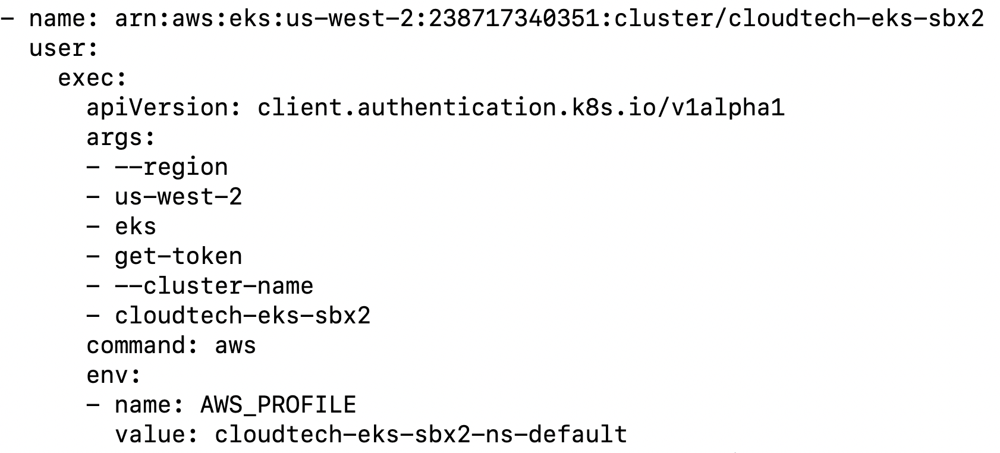

# Using custom_role binding to EKS namespace

## Objective

This document guides to create custom policy with AWS services and assign permissions at granularity. Create custom roles [assume roles] and grant to users by mapping their unique AD-SID (mascot). Developers/Administrators can access and manage the AWS services for development or administration tasks/activities and fulfill AWS EKS (Kubernetes) RBAC support

## Create custom policy

For example Policy name: `eks-demo-cluster-policy1`

Below policy contains "service - EKS" with permissions list and describe a cluster and nodegroups
```json

{
    "Version": "2012-10-17",
    "Statement": [
        {
            "Sid": "VisualEditor0",
            "Effect": "Allow",
            "Action": [
                "eks:DescribeNodegroup",
                "eks:ListNodegroups",
                "eks:ListTagsForResource",
                "eks:ListUpdates",
                "eks:DescribeUpdate",
                "eks:DescribeCluster"
            ],
            "Resource": [
                "arn:aws:eks:us-west-2:<update your AWS Account>:cluster/<update your EKS Cluster Name>",
                "arn:aws:eks:us-west-2:<update your AWS Account>:fargateprofile/<update your EKS Cluster Name>/*/*",
                "arn:aws:eks:us-west-2:<update your AWS Account>:nodegroup/<update your EKS Cluster Name>/*/*"
            ]
        },
        {
            "Sid": "VisualEditor1",
            "Effect": "Allow",
            "Action": "eks:ListClusters",
            "Resource": "*"
        }
    ]
}
```
## Create custom role with Trust relationships and permission boundary

For role name `eks-demo-cluster-role1`, attach custom policy `eks-demo-cluster-policy1` with permission boundary `ais-permissions-boundaries`.



Note - Request associates to share the `appleAlternateDSID`.

### Shell Command to Pull MASCOT AD-SID

#### Syntax

```bash
$ ldapsearch -s sub -x -H ldaps://lookup.apple.com -b ou=people,o=apple appledsid=<Your DSID> | grep appleAlternateDSID
```
**Note:** Your DSID can be pulled from Apple Directory

Example

```bash
$ ldapsearch -s sub -x -H ldaps://lookup.apple.com -b ou=people,o=apple appledsid=2319901145 | grep appleAlternateDSID

### Below shows output for mascot-id
appleAlternateDSID: 001956-04-b7297079-c290-4d7e-883f-e77c3deef72f
```
Edit the *Trust relationships tab* for the custom role created. Example role name # eks-demo-cluster-role1 [eks-cloudtech-eks-sbx2-ns-default]



Update the JSON format with MASCOT AD-SID as provided below sample

```json
{
  "Version": "2012-10-17",
  "Statement": [
    {
      "Effect": "Allow",
      "Principal": {
        "AWS": "arn:aws:sts::238717340351:assumed-role/custom_role/MASCOT-001956-04-b7297079-c290-4d7e-883f-e77c3deef72f"
      },
      "Action": "sts:AssumeRole"
    }
  ]
}
```
Click on Update Trust Policy to update the policy



# Kubernetes Administrator tasks

## Create RoleBinding

Kubernetes RoleBinding allows us to grant permission defined in a role to single user or set of users. RoleBinding holds list of subjects and a reference to the role being granted. Permissions can be granted with in a “Namespace” with a RoleBinding

Namespace --> default
roleRef --> ClusterRole - *view [Can read only objects, restricted to edit/create]*
Named Group --> developer1

```yaml
kind: RoleBinding
apiVersion: rbac.authorization.k8s.io/v1
metadata:
   name: developer1     # Maintain your own naming convention
   namespace: default   # Replace it with namespace you would like to give access to
subjects:
- kind: Group
  name: developer1  # Name of the group mapped in aws-auth (Maintain your own naming convention)
  apiGroup: rbac.authorization.k8s.io
roleRef:
  kind: ClusterRole
  name: view  # ClusterRole to grant permissions to (you can create a custom role for more granular permissions)
  apiGroup: rbac.authorization.k8s.io
```
#### Execute command
```bash
$kubectl apply -f developer-group-1-rolebinding.yaml
```

## Assume role mapping to "aws-auth" ConfigMap under namespace “kube-system”

Navigate to ```aws-auth``` ConfigMap under namespace ```kube-system``` and update the maprole with details of custom role `rolearn` attributes, `username` (provide development team name) and defined group name in rolebinding.

Below example shows the update of maproles



# Developer/End User Tasks

You will need to maintain in `aws-profile` to switch the role to access the AWS account specific to AWS services or to access specific Kubernetes namespace granted by support team

In our use-case developer needs only access to the EKS Cluster specific to namespace “default”

Navigate to `~/.aws/config` and update AIS provided `custom_role` and `source_profile`.

### Prerequisite

* *Request for custom_role via access manager*
* *Get the assume role (custom role) to maintain in source profile from your aws support team*

Example profile maintained in `~/.aws/config`

```bash
[profile cloudtech-sbx]
credential_process = awsappleconnect -u vraoperumalla -a 238717340351 -r custom_role
region = us-west-2

[profile cloudtech-sbx-ns-default]
source_profile = cloudtech-sbx
role_arn = arn:aws:iam::238717340351:role/eks-cloudtech-eks-sbx2-ns-default
role_session_name =<apple-id>@eks-cloudtech-eks-sbx2-ns-default
region = us-west-2
```

### Validate aws custom role switch
```bash
$ aws sts get-caller-identity —profile cloudtech-eks-sbx2-ns-default
{
"UserId": "AROATPFFJRK75HTA5GB5I:vraoperumalla@eks-cloudtech-eks-sbx2-ns-default",
"Account": "238717340351",
"Arn": "arn:aws:sts::238717340351:assumed-role/eks-cloudtech-eks-sbx2-ns-default/vraoperumalla@eks-cloudtech-eks-sbx2-ns-default"
}
```
### Validate AWS Console login

```bash
$ aws-login
```
To validate, user once accessed to aws console, on top right of the screen can view federated login and role granted



## Update kubectl config

Execute below command to update EKS cluster details
```bash
$ aws eks --region us-west-2 update-kubeconfig —name <EKS_CLUSTER_NAME>
```
Further navigate to ~/.kube/config file. You can view your EKS cluster and profile been updated



## Kubernetes Namespace validate access control

Below sample `kubectl` command trying to view all namespace to ensure RoleBinding is reflected to the assume-role (custom roles)

```bash
$ kubectl get ns
Error from server (Forbidden): namespaces is forbidden: User "developer1" cannot list resource "namespaces" in API group "" at the cluster scope
```

Below sample `kubectl` command shows resources from specific namespace, which is expected as in this document Rolebinding has been granted to default namespace only for the developer

```bash
$ kubectl get pods -n default
NAME READY STATUS RESTARTS AGE
consul-0 1/1 Running 0 9d
consul-1 1/1 Running 0 9d
consul-2 1/1 Running 0 9d
consul-3 1/1 Running 0 9d
dnsutils 1/1 Running 29 29h
minio-f9ddc67f-p6twm 1/1 Running 0 106m
redis-master-0 1/1 Running 0 26h
redis-slave-0 1/1 Running 0 26h
redis-slave-1 1/1 Running 0 26h
vault-0 1/1 Running 0 8d
vault-agent-injector-6c596cff7d-ml2kk 1/1 Running 0 8d
```
Below sample `kubectl` command shows restricted access to other namespace, which is expected as in this document Rolebinding has been granted to default namespace only for the developer

```bash
$ kubectl get pods -n kube-system
Error from server (Forbidden): pods is forbidden: User "developer1" cannot list resource "pods" in API group "" in the namespace "kube-system"
```
