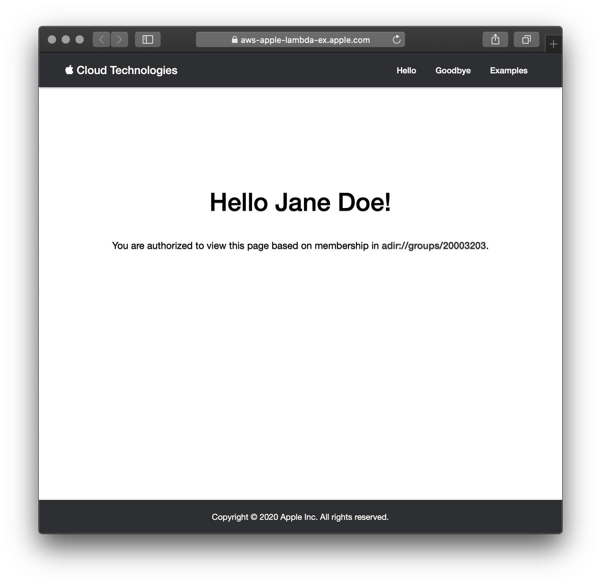
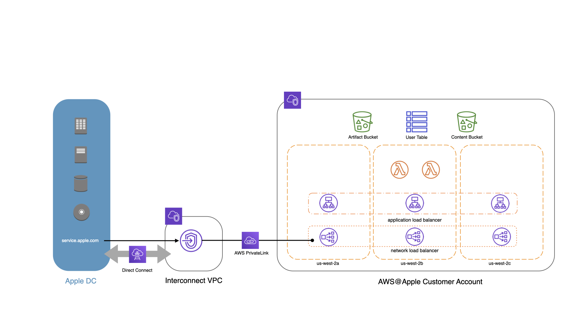

# Lambda + ALB + DynamoDB

## Overview
In this example, we will create two Lambda functions, a DynamoDB table, an Application Load Balancer, and a Network Load Balancer. 

The first Lambda function will run an example Flask application that leverages AppleConnect authentication, Bootstrap, a 'User' model backed by DynamoDB, and static assets retrieved directly from S3.



We'll use an ALB to target the Flask Lambda, and put an NLB in front of the ALB to establish a connection from Apple. The second Lambda function is tasked with keeping the NLB's targets in sync with the ALB in case of any IP changes.

The architecture looks like this:



The key to get Flask to run inside of Lambda is [`apig-wsgi`](https://pypi.org/project/apig-wsgi/). There are other options available, but this provides a very clean lambda function. For example, this is a valid lambda flask app:

```python
from flask import Flask, jsonify
from apig_wsgi import make_lambda_handler

app = Flask(__name__)
handler = make_lambda_handler(app)

@app.route('/')
def index():
    return jsonify('index')
```

## Prerequisites

### Local development & testing

#### Environment

The Example Flask application relies on the following environment variables which are passed in through CloudFormation inputs:
```bash
export SECRET_NAME=acSecret
export BUCKET_NAME=example-lambda-content-us-west-2-test
export DYNAMODB_TABLE_NAME=user
```

For local development & testing, we leverage a `.env` file containing these values. In order for the included tests to pass, a `pytest.ini` file needs to be added to `./app/` containing the following:
```ini
[pytest]
env_override_existing_values = 1
env_files =
    /<path>/<to>/.env

```

#### AppleConnect

AppleConnect authentication requires you to supply an HTTPS endpoint to redirect the user to after successful authentication. For local development, you can add the custom domain name to your `/etc/hosts` file and run a local web server to handle TLS termination with a self-signed certificate.

```
sudo bash -c "cat >> /etc/hosts" << EOF
127.0.0.1       aws-apple-lambda-ex.apple.com
EOF
```

### SNS Email Subscription for DynamoDB Alarms
The `./scripts/vars.sh` script exports an `SNS_EMAIL` variable which is passed as an overridden parameter to the DynamoDB CloudFormation Stack. This variable must be set or stack creation will fail.

### Secrets Manager Secret
The example application requires a secret (default ID: "acSecret") to be created in SecretsManager with the following JSON content containing your application's idMS configuration parameters:
```json

{
    "appId": "<ds-app-id>",
    "appIdKey": "<ds-app-id-key>",
    "appPassword": "<ds-app-admin-password>",
    "appEnvironment": "<ds-env>",
    "accessGroup": "<ds-group-id>"
}
```
This secret is retrieved during invocation and is used by the Flask-AppleConnect library to perform authentication. The `accessGroup` is used to enforce additional authorization based on membership in a configurable DS group.

## To Build
```bash
$ aws-profile dev
[dev]$ ./scripts/provision.sh
```

## Testing the routes

```bash
[dev]$ ./scripts/curl.sh
+ curl -i vpce-0293db673bd94db80-mu4qn8ro.vpce-svc-06a77f0f3b0203dde.us-west-2.vpce.amazonaws.com/internal/health
HTTP/1.1 302 Moved Temporarily
Server: awselb/2.0
Date: Tue, 05 May 2020 21:37:08 GMT
Content-Type: text/html; charset=utf-8
Content-Length: 535
Connection: keep-alive
Location: https://idmsac-uat.corp.apple.com/IDMSWebAuth/login?appIdKey=<redacted>&path=/&rv=1&language=US-EN

<!DOCTYPE HTML PUBLIC "-//W3C//DTD HTML 3.2 Final//EN">
<title>Redirecting...</title>
<h1>Redirecting...</h1>
<p>You should be redirected automatically to target URL: <a href="https://idmsac-uat.corp.apple.com/IDMSWebAuth/login?appIdKey=<redacted>&amp;path=/&amp;rv=1&amp;language=US-EN">https://idmsac-uat.corp.apple.com/IDMSWebAuth/login?appIdKey=<redacted>&amp;path=/&amp;rv=1&amp;language=US-EN</a>.  If not click the link.

[dev]$ ./scripts/curl.sh internal/health
+ curl -i vpce-0293db673bd94db80-mu4qn8ro.vpce-svc-06a77f0f3b0203dde.us-west-2.vpce.amazonaws.com/internal/health
HTTP/1.1 200 OK
Server: awselb/2.0
Date: Tue, 05 May 2020 21:38:15 GMT
Content-Type: application/json
Content-Length: 47
Connection: keep-alive
```

## To Destroy
Note: since the VPC exists in a VPC, it takes a long time for CloudFormation to delete the Lambda functions and associated ENIs. We have esclated this as a problem with our account team, but expect the destroy to take around ~45 minutes.

```bash
[dev]$ ./scripts/destroy.sh
```

## Run Unit Tests

```bash
cd ./app
$ python -m pytest -c pytest.ini ./tests
================================================================================ test session starts ================================================================================
platform darwin -- Python 3.7.7, pytest-4.6.3, py-1.8.0, pluggy-0.12.0
rootdir: /Users/sam/Projects/CloudTech/aws-apple/examples/lambda_alb_dynamodb/app/tests, inifile: pytest.ini
plugins: xdist-1.29.0, forked-1.0.2, dotenv-0.4.0
collected 8 items

tests/test_api.py ...                                                                                                                                                         [ 37%]
tests/test_config.py ...                                                                                                                                                      [ 75%]
tests/test_models.py .                                                                                                                                                        [ 87%]
tests/test_wsgi.py .                                                                                                                                                          [100%]

============================================================================= 8 passed in 10.95 seconds =============================================================================```
```

# ToDo
* Move the example to 443 with SSL Certificates.

# References
* https://docs.aws.amazon.com/lambda/latest/dg/python-package.html
* https://medium.com/driven-by-code/lightweight-serverless-api-using-aws-lambda-and-alb-8826129c90af
* https://flask.palletsprojects.com/en/1.1.x/quickstart/
