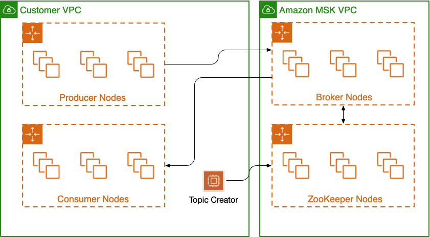
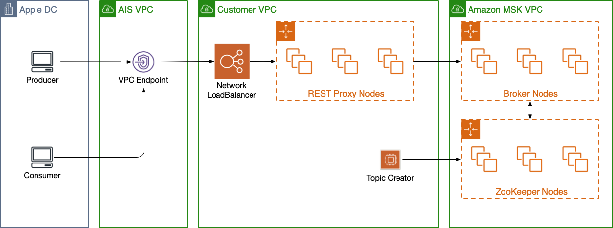

# Amazon Managed Streaming for Apache Kafka

[Amazon MSK](https://docs.aws.amazon.com/msk/latest/developerguide/what-is-msk.html) is a fully managed service that enables you to build and run applications that use Apache Kafka to process streaming data.

In this example we will deploy a Managed Kafka cluster in AWS@Apple.

## Prerequisites

- Basic Knowledge about [AWS@Apple](https://aws.apple.com)
- Basic Knowledge about [Apache Kafka](https://kafka.apache.org/intro)
- Basic Knowledge about [AWS MSK](https://docs.aws.amazon.com/msk/latest/developerguide/what-is-msk.html)

## Deployment

1. Edit the `vars.sh` file
1. Run `provision.sh`

    ```bash
    $ ./provision.sh
    + aws cloudformation deploy --no-fail-on-empty-changeset --template-file msk.yaml --stack-name msk-mskatapple --parameter-overrides ClusterName=mskatapple InstanceTypE=kafka.t3.small VolumeSize=100 EnhancedMonitoring=DEFAULT KafkaVersion=2.2.1 NumberOfBrokerNodes=3

    Waiting for changeset to be created..
    Waiting for stack create/update to complete
    Successfully created/updated stack - msk-mskatapple
    ++ aws cloudformation --output=text list-exports --query 'Exports[?Name==`msk-mskatapple-Cluster`].Value'
    + KAFKA_CLUSTER_ARN=arn:aws:kafka:us-west-2:404268134887:cluster/mskatapple/d8be3e38-de34-4d32-be80-0a504656c723-2
    ++ aws cloudformation --output=text list-exports --query 'Exports[?Name==`msk-mskatapple-TC-SG`].Value'
    + TOPIC_CREATOR_SG=sg-0313febd22ca2f822
    ++ aws cloudformation --output=text list-exports --query 'Exports[?Name==`msk-mskatapple-PC-SG`].Value'
    + PRODUCER_CONSUMER_SG=sg-052c6f24dff8659c2
    + aws cloudformation deploy --no-fail-on-empty-changeset --template-file tc.yaml --stack-name msk-mskatapple-tc --parameter-overrides KafkaClusterArn=arn:aws:kafka:us-west-2:404268134887:cluster/mskatapple/d8be3e38-de34-4d32-be80-0a504656c723-2 KafkaSecurityGroup=sg-0313febd22ca2f822 --capabilities=CAPABILITY_IAM

    Waiting for changeset to be created..
    Waiting for stack create/update to complete
    Successfully created/updated stack - msk-mskatapple-tc
    + aws cloudformation deploy --no-fail-on-empty-changeset --template-file client.yaml --stack-name msk-mskatapple-client --parameter-overrides KafkaClusterArn=arn:aws:kafka:us-west-2:404268134887:cluster/mskatapple/d8be3e38-de34-4d32-be80-0a504656c723-2 KafkaSecurityGroup=sg-052c6f24dff8659c2 --capabilities=CAPABILITY_IAM

    Waiting for changeset to be created..
    Waiting for stack create/update to complete
    Successfully created/updated stack - msk-mskatapple-client
    ++ aws cloudformation --output=text list-exports --query 'Exports[?Name==`msk-mskatapple-tc-InstanceID`].Value'
    + TC_INSTANCE_ID=i-0c5b674877fa9665f
    ++ aws cloudformation --output=text list-exports --query 'Exports[?Name==`msk-mskatapple-client-InstanceID`].Value'
    + CLIENT_INSTANCE_ID=i-0a91c5241ddf5e80a

    Kafka Cluster ARN:          arn:aws:kafka:us-west-2:404268134887:cluster/mskatapple/d8be3e38-de34-4d32-be80-0a504656c723-2
    Topic Creator Instance:     i-0c5b674877fa9665f
    Producer/Consumer Instance: i-0a91c5241ddf5e80a
    ```

1. Wait for 25 minutes aprox while the cluster is created.

__NOTE__: For this example the `provision.sh` script will create two EC2 instances consisting of:

- A topic creator
- A producer/consumer

A more realistic scenario is to have a pool of producers and a pool of consumers



## Producing/Consuming Messages

Please refer to [Amazon MSK Getting started Guide](https://aws.amazon.com/msk/getting-started/)

- [Step 5:](https://docs.aws.amazon.com/msk/latest/developerguide/create-topic.html) Create a Topic
- [Step 6:](https://docs.aws.amazon.com/msk/latest/developerguide/produce-consume.html) Produce and Consume Data

## Limitations

ZooKeeper and Kafka are accessible from the VPC only. The reason behind this is that for both protocols, the client must be able to communicate directly to each of the nodes in the cluster.
One common approach to configure an unmanaged Kafka implementation behind load balancers consists of creating one load balancer per broker node; however, this also requires changing the broker node configuration to advertise listeners as follows:

- The "INTERNAL" listener is the IP/FQDN of the node
- The "EXTERNAL" listener is the IP/FQDN of the load balancer

This is not possible in MSK since broker nodes and their configuration are managed by AWS.

## FAQ

### How to produce and consume messages from the Apple Datacenters

Due to limitations mentioned above, producers and consumers from the Apple Datacenters cannot communicate directly to broker nodes in AWS.
The Alternatives are:

- Deploy a Kafka REST proxy to enable your producers and consumers to communicate with the cluster through HTTP API requests.
- Deploy MSK on an [Enterprise VPC](https://aws.apple.com/guides/networking/onboarding-to-denali-at-aws-apple/) which has ip addresses routable from Apple datacenters.
- Build and manage your own Kafka Cluster in EC2.

### What is a Kafka REST Proxy

REST proxies enable your producers and consumers to communicate with the cluster through HTTP API requests.
You can deploy the [Confluent REST Proxy](https://docs.confluent.io/current/kafka-rest/index.html) in EC2 and then expose it to Apple datacenters with a VPC Endpoint.


## References

1. [AWS@Apple](https://aws.apple.com)
1. [Apache Kafka Introduction](https://kafka.apache.org/intro)
1. [Amazon MSK Getting started Guide](https://docs.aws.amazon.com/msk/latest/developerguide/getting-started.html)
1. [Amazon MSK Developer Guide](https://docs.aws.amazon.com/msk/latest/developerguide/what-is-msk.html)
1. [Kafka in AWS with SSL Offloading using Load Balancer](https://medium.com/code-tech/kafka-in-aws-with-ssl-offloading-using-load-balancer-c337da1435c3)
1. [Confluent REST Proxy](https://docs.confluent.io/current/kafka-rest/index.html)
1. [Onboarding to Denali at AWS@Apple](https://aws.apple.com/guides/networking/onboarding-to-denali-at-aws-apple/)
