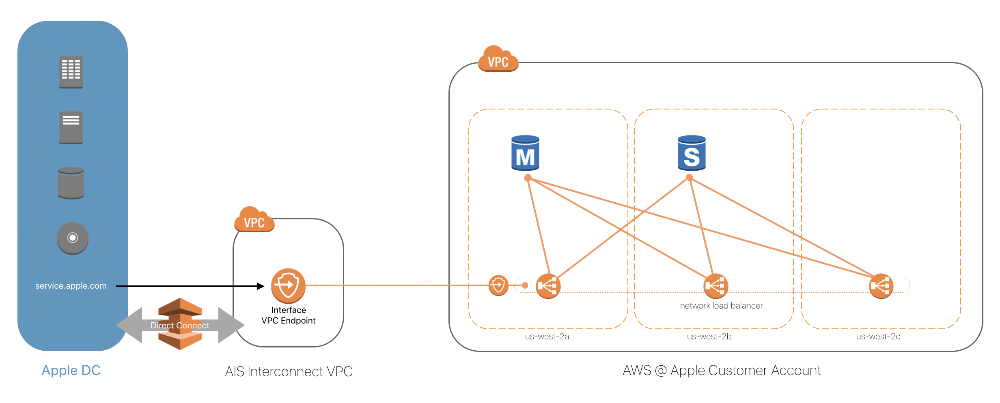

# Amazon Relational Database Service

[Amazon RDS](https://docs.aws.amazon.com/AmazonRDS/latest/UserGuide/Welcome.html) Is a managed services that provisions and manages different databases such as aurora, mysql, mariadb, postgres, mssql or oracle.

There are 3 types of RDS Deployments:

- **RDS:** This deployment type deploys a database engine on amazon managed EC2 Instances where the user is responsible for choosing the right instance size. It currently supports MySQL, Postgres, MSSQL and Oracle engines.
- **Aurora:** Amazon Aurora is a database engine created by Amazon wich can be used as a drop-in replacement for MySQL or Postgres. It also uses managed EC2 Instances.
- **Aurora Serverless:** This is an on-demand, auto-scaling configuration of amazon aurora where the database will automatically start up, scale up, scale down and even stop all instances based on your application needs.

## Deploying RDS

_NOTE_: This example shows how to deploy mysql or postgres databases but users should be able to launch other engine types with minimal modification.

To provision a sample cluster run the `provision.sh` script

```text
Usage: ./provision.sh [options]
 -d, --db-name                    Database Name (default: RDSAtApple)
 -e, --db-engine <mysql|postgres> Database Engine (default: mysql)
 -i, --instance-type              Instance Type (default: db.t3.small)
 -s, --storage-size               The amount in GB of storage on the RDS instance (default: 100)
 -v, --vpc-endpoint               Create a vpc endpoint for the database (default: false)
 ```

## Accessing RDS Instances from Apple Network

_NOTE_: This solution is only appropriate for low bandwidth, and potentially high latency applications needing access to a managed relational database. Since the connections are going to be routed from an Apple DC into AWS (in the us-west-2 region),  you might be subject to unacceptable latency or bandwidth constraints.

This solution will deploy RDS via CloudFormation, and then build a NLB with a VPC Endpoint that tunnels through an AIS supported DirectConnect. That means you'll be able to access your database from the Apple Desktop Network. After setup the network architecture will look like this.



To deploy NLB and VPC Endpoint pass the `--vpc-endpoint true` parameter to `provision.sh`

### Limitations

The following are limitations for accessing RDS from Apple Network and they do not affect EC2 instances connecting to the database endpoints:

- By default, MySQL will block the NLB health check, and we had to set `max_connect_errors: 8388608` so that the health check could fail consecutively, but not block the NLB IP. For more information see: [MySQL max_connect_errors](https://dev.mysql.com/doc/refman/8.0/en/server-system-variables.html#sysvar_max_connect_errors). This number was set to accommodate 10 failures per second for an entire week. After a week the DB will block the NLB IP, and you will have to manually flush the cache.
- After an instance failover the IP addresses of the RDS instances may change and the target group would need to be manually updated with the new ip addresses.

### Connecting to the DB from Apple Network

1. Export `RDS_STACK_NAME` and `VPCE_STACK_NAME`

    ```bash
    export RDS_STACK_NAME=rdsatapple-rds-1171-jane-smith
    export VPCE_STACK_NAME=rdsatapple-vpce-1171-jane-smith
    ```

    Alternatively

    ```bash
    source vars.sh
    ```

2. Obtain SQL password from Secrets Manager

    ```bash
    SECRET=$(aws cloudformation --output=text list-exports --query "Exports[?Name==\`${RDS_STACK_NAME}-Secret\`].Value")
    SQL_PASSWORD=$(aws secretsmanager get-secret-value --secret-id $SECRET --query SecretString --output text | jq -r '.password')
    ```

3. Obtain vpc endpoint

    ```bash
    ENDPOINT=$(aws cloudformation --output=text list-exports --query "Exports[?Name==\`${VPCE_STACK_NAME}-VPCE-DNSName\`].Value")
    ```

4. Connect!

    4a) For MySQL:

    ```bash
    mysql --ssl-mode=REQUIRED --host=$ENDPOINT --user=rdsatappleadmin --password=$SQL_PASSWORD RDSAtApple
    Welcome to the MySQL monitor.  Commands end with ; or \g.
    Your MySQL connection id is 7111
    Server version: 5.6.10 MySQL Community Server (GPL)

    Copyright (c) 2000, 2019, Oracle and/or its affiliates. All rights reserved.

    Oracle is a registered trademark of Oracle Corporation and/or its
    affiliates. Other names may be trademarks of their respective
    owners.

    Type 'help;' or '\h' for help. Type '\c' to clear the current input statement.

    mysql> \s
    --------------
    mysql  Ver 8.0.17 for osx10.14 on x86_64 (Homebrew)

    Connection id:          7111
    Current database:       RDSAtApple
    Current user:           rdsatappleadmin@10.1.21.69
    SSL:                    Cipher in use is ECDHE-RSA-AES128-GCM-SHA256
    Current pager:          less
    Using outfile:          ''
    Using delimiter:        ;
    Server version:         5.6.10 MySQL Community Server (GPL)
    Protocol version:       10
    Connection:             vpce-07005c463ab5f3adc-8u40ogx6.vpce-svc-0d074fb80b8ee9a10.us-west-2.vpce.amazonaws.com via TCP/IP
    Server characterset:    latin1
    Db     characterset:    latin1
    Client characterset:    utf8mb4
    Conn.  characterset:    utf8mb4
    TCP port:               3306
    Uptime:                 24 min 3 sec

    Threads: 53  Questions: 4013  Slow queries: 2  Opens: 89  Flush tables: 1  Open tables: 82  Queries per second avg: 2.781
    --------------

    mysql> \q
    Bye
    ```

    4b) For PostgreSQL:

    ```bash
    PGPASSWORD=$SQL_PASSWORD psql "host=$ENDPOINT user=rdsatappleadmin dbname=RDSAtApple sslmode=require"
    psql (11.5, server 10.7)
    SSL connection (protocol: TLSv1.2, cipher: ECDHE-RSA-AES256-SHA, bits: 256, compression: off)
    Type "help" for help.

    RDSAtApple=> \conninfo
    You are connected to database "RDSAtApple" as user "rdsatappleadmin" on host "vpce-08c9454af562e14e7-cleymz2a.vpce-svc-0f331ebaaeb81e89b.us-west-2.vpce.amazonaws.com" at port "5432".
    SSL connection (protocol: TLSv1.2, cipher: ECDHE-RSA-AES256-SHA, bits: 256, compression: off)
    RDSAtApple=>
    exit
    ```

## Clean Up

To delete the example run destroy.sh

```bash
$ ./destroy.sh
+ python ../utilities/delete_stack.py rdsatapple-vpce-1171-jane-smith rdsatapple-rds-1171-jane-smith
Initiating delete_stack for: rdsatapple-vpce-1171-jane-smith
DELETE_COMPLETE: rdsatapple-vpce-1171-jane-smith

Initiating delete_stack for: rdsatapple-rds-1171-jane-smith
DELETE_COMPLETE: rdsatapple-rds-1171-jane-smith
```

## Future Work

- Support [IAM DB Authentication](https://docs.aws.amazon.com/AmazonRDS/latest/UserGuide/UsingWithRDS.IAMDBAuth.html) instead of just User/Password via SecretsManager.
- Support Aurora for both PostgreSQL and MySQL
