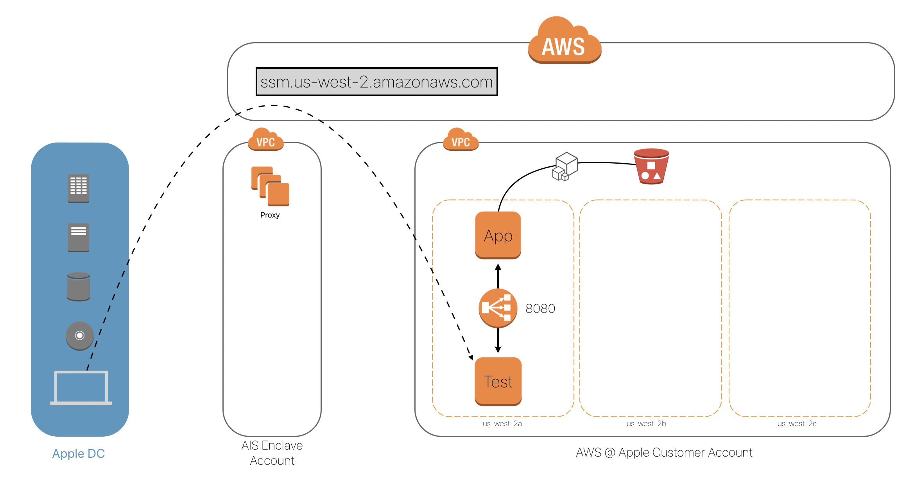

# Two EC2 Instances with a NLB

In this folder we have a self contained example with two EC2 instances. One which you use for access/testing, and the other which runs an application. The application is fronted by a Network Load Balancer (NLB). It looks like this:

For the application instance, we're going to use Ansible to configure a simple Flask app on it. We chose a NLB instead of an Application Load Balancer (ALB), because as of the writing of this README, ALBs were not supported with AWS PrivateLink.

# Prerequisites

Before running this stack, you should setup your [CLI environment](../../setup/). Besides that, there will be nothing else expected in your local environment.

# Deploying the Stack

To deploy the stack, simply run: `./provision.sh`.

# Updating the Stack

If you need to update any of the resources CloudFormation template, simply make the change, and then run: `./provision.sh`. That will trigger update the stack and resources. If you need to update the configuration on the application instance, see below to re-run Ansible.

# Updating the Running Instances

If you changed the Ansible playbook, and want to run that on the instances without changing the auto scaling group, you can just trigger a playbook run by doing the following: `./update_hosts.sh`.

# Deleting the Stack

To delete the stack, simply run: `./destroy.sh`.
